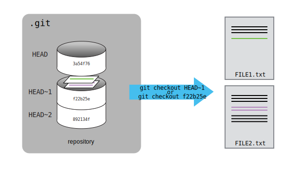

<!-- .slide: class="slide-title" -->

# Introducción a Git y Github

---

<!-- 7 minutos -->

# Objetivos

- Gestionar versiones con Git
- Aplicar las mejores prácticas de Git
- Trabajar con repositorios remotos (GitHub)
- Trabajar de forma colaborativa

---

# Contenidos

<div class="container">
<div class="column">

- Control Automatizado de Versiones
- Configuración Git
- Cómo crear un repositorio
- Cómo registrar los cambios
- Explorar el "History"

</div>
<div class="column">

- Cómo ignorar determinados archivos
- Repositorios remotos en GitHub
- Trabajos en colaboración
- Conflictos
- Trabajo colaborativo con ramas (opcional)

</div>
</div>

---

# Control Automatizado de Versiones

---


<div class="bottom">
<a href="http://phdcomics.com/comics/archive.php?comicid=1531">
"Piled Higher and Deeper" by Jorge Cham
</a>
</div>

---

# Sistema de control de versiones


---

# Sistema de control de versiones


---

# Sistema de control de versiones


---

# Sistema de control de versiones

- Realiza seguimiento de cambios o **commits**
- Es como un _deshacer_ sin límites
- Permite que mucha gente trabaje en lo mismo en paralelo
- **Repositorio:** El historial completo de **commits**

---

Imagina que has redactado un excelente párrafo para un artículo que estás
escribiendo, pero más tarde lo estropeas.

¿Cómo recuperarías aquella excelente versión de la conclusión? ¿Es esto
posible?

---

<!-- 5 minutos -->

# Configurando git

---

# Configurando git

- Nombre
- Mail
- Editor de texto favorito

---

## Comandos de git

- `git config --global user.name "tu_nombre"` : configura el nombre con el que
  quedará registrada la actividad que hagas en `git`.
- `git config --global user.email "tu_mail"` : configura el mail que quedará
  asociado a la actividad que hagas en `git`.
- `git config --global core.editor "tu_editor_favorito"`: configura el editor
  que usará `git`.

---

<!-- 10 minutos -->

# Creando un repositorio

---

## Comandos útiles de bash

- `mkdir`: crea una nueva carpeta (_make directory_)
- `ls`: lista los archivos y carpetas del directorio actual (_list_)
- `cd`: cambia de directorio (_change directory_)

---

## Comandos de git

- `git init`: crea un nuevo repositorio en la carpeta actual
- `git status`: revisamos el estado del repositorio

---

<!-- 20 minutos -->

# Rastreando Cambios

---

## Staging Area


---

## Comandos de git

- `git add`: añade uno o más archivos al **staging area**
- `git commit`: registra los cambios de la **staging area** en un commit
- `git log`: muestra un historial de cambios
- `git diff`: muestras las diferencias entre el estado actual de los archivos
  y la versión del commit más reciente
- `git diff --staged`: muestra las diferencias entre el estado de los archivos
  en el staging area y la versión del commit más reciente.

---

## Ejercicio

---

## 1. Multiple choice

¿Qué comandos guardarían los cambios de un archivo modificado `myfile.txt` en el repositorio creado previamente?

<ol>
    <li>
    <pre><code> $ git commit -m "my recent changes" </code></pre>
    </li>
    <li>
    <pre><code>
    $ git init myfile.txt
    $ git commit -m "my recent changes"
    </code></pre>
    </li>
    <li>
    <pre><code>
    $ git add myfile.txt
    $ git commit -m "my recent changes"
    </pre></code>
    </li>
    <li>
    <pre><code>$ git commit -m myfile.txt "my recent changes"</pre></code>
    </li>
</ol>

<!--
    1- Would only create a commit if files have already been staged.
    2- Would try to create a new repository.
    3- Is correct: first add the file to the staging area, then commit.
    4- Would try to commit a file “my recent changes” with the message myfile.txt.
-->

---

<!-- 25 minutos -->

# Explorando el historial

---

# Explorando el historial



---

## Comandos de git

- `HEAD`: simboliza el commit más reciente.
- `git diff HEAD~2`: nos muestra las diferencias respecto a los últimos
  dos commits.
- `git show HEAD~1`: nos muestra los cambios realizados por el penúltimo commit.
- Podemos usar el identificador del commit en vez de `HEAD`.
- `git checkout`: nos deja _visitar_ commits anteriores.
- Nunca hay que hacer commits si no estamos en `HEAD`.

---

## Ejercicios

---

## 2. Multiple choice

Jennifer ha realizado cambios en el script en el que ha estado trabajando
durante semanas, y las modificaciones que hizo esta mañana “corrompieron” el
script y ya no funciona.
Por suerte, ha estado usando Git.

---

## 2. Multiple choice

Si Jennifer todavía no hizo ningún commit ni agrego los cambios al stage area:
¿Cuáles comandos le permitirán recuperar la última versión estable de su script llamado script.py?

<ol>
    <li>
    <pre><code>$ git checkout HEAD
    </code></pre>
    </li>
    <li>
    <pre><code>$ git checkout HEAD script.py
    </code></pre>
    </li>
    <li>
    <pre><code>$ git checkout HEAD~1 script.py
    </code></pre>
    </li>
    <li>
    <pre><code>$ git checkout [ID_last_commit] script.py
    </code></pre>
    </li>
    <li>
    <pre><code>Ambos 2 y 4
    </code></pre>
    </li>
</ol>

---

## 3. Multiple choice

¿Cuál es el output de `cat tierra.txt` al final de este conjunto de comandos?

```bash
cd sistema_solar
nano tierra.txt # agrega el siguiente texto: La Tierra se formó hace aproximadamente 4550e6 de años.
git add tierra.txt
nano tierra.txt # agrega el siguiente texto: La vida surgió unos 1000e6 de años después de su creacion.
git commit -m "Datos sobre la creacion del planeta"
git checkout HEAD tierra.txt
cat tierra.txt # esto imprimirá el contenido de tierra.txt en la pantalla
```

<ol>
<li>
<pre><code data-trim data-noescape>
La vida surgió unos 1000e6 de años después de su creacion.
</code></pre>
</li>
<li>
<pre><code data-trim data-noescape>
La Tierra se formó hace aproximadamente 4550e6 de años.
</code></pre>
</li>
<li>
<pre><code data-trim data-noescape>
La vida surgió unos 1000e6 de años después de su creacion.
La Tierra se formó hace aproximadamente 4550e6 de años.
</code></pre>
</li>
<li>
<pre><code data-trim data-noescape>
Error because you have changed tierra.txt without committing the changes
</code></pre>
</li>
</ol>

---

<!-- 5 minutos -->

# Ignorar archivos

---

# Ignorando archivos

¿Qué pasa si tenemos archivos que no queremos que Git rastree?

Debemos crear un **.gitignore**

---

# Repositorios remotos en GitHub

---


- Nos permite almacenar repositorios remotos
- Facilita la colaboración
- Issues y Pull Requests
- Mucho más:
  - Code review
  - Releases
  - Continuous Integration
  - GitHub Pages

---

Material basado en la lección desarrollada por
[Software Carpentry](https://software-carpentry.org/):

- [Control de versiones con git (español)](https://swcarpentry.github.io/git-novice-es/)

- [Version Control with Git (English)](https://swcarpentry.github.io/git-novice/)

---

<!-- .slide: class="slide-license" -->

<p class="license-icons">
<i class="fab fa-creative-commons"></i><i class="fab fa-creative-commons-by"></i>
</p>

El contenido de esta presentación está disponible bajo

[Creative Commons Attribution 4.0 International License](https://creativecommons.org/licenses/by/4.0/)

---

<!-- .slide: class="slide-title" -->

# Muchas gracias
